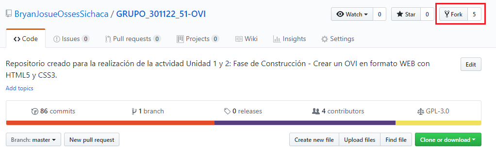
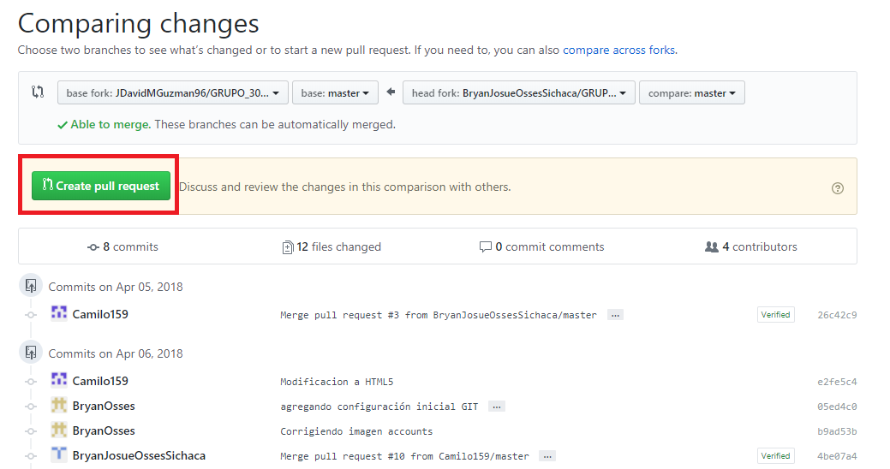

# GRUPO_301122_51-OVI

Este es el código fuente realizado para la actividad Unidad 1 y 2: Fase de Construcción - Crear un OVI en formato WEB con HTML5 y CSS3 del curso de diseño web.

# Github Pages

El proyecto esta publicado en Github Pages a traves de esta [*URL*](https://bryanjosueossessichaca.github.io/GRUPO_301122_51-OVI/) 

* *https://bryanjosueossessichaca.github.io/GRUPO_301122_51-OVI/*

# Contribución

Esta obra está bajo una Licencia [*Creative Commons Atribución-NoComercial 4.0 Internacional*](https://creativecommons.org/licenses/by-nc/4.0/).
Todos los integrantes del grupo 51 del curso de diseño web (301122) son libres de agregar, editar y corregir el OVI. 

# Como editar

El código fuente esta almacenado en la plataforma Github, el [Fork & Pull workflow](https://help.github.com/articles/using-pull-requests) es utilizado para aceptar y revisar los cambios sobre el OVI.

* No olvidar realizar Fork del repositorio:

* Enviar sus cambios a través de pull request

* **¡Importante Actualizar periódicamente el Fork o copia realizado del repositorio, para tener la versión más actual disponible!

# Requisitos

* Una [cuenta de Github](https://github.com)
* Tener instalado Git, en caso de estar familiarizado con los comandos de Git solo hace falta la linea de comandos (Git bash) de otra manera puede descargar herramientas que le ofrezcan una interfaz grafica para trabajar con Git como [Github Desktop](https://desktop.github.com/) o [sourceTree](https://www.sourcetreeapp.com/)

